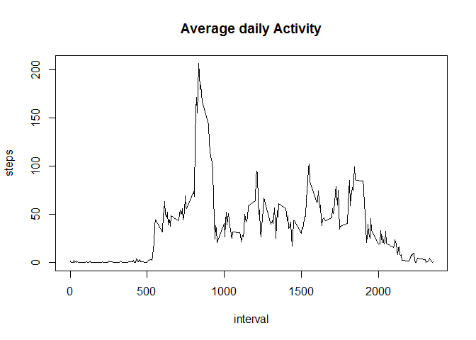
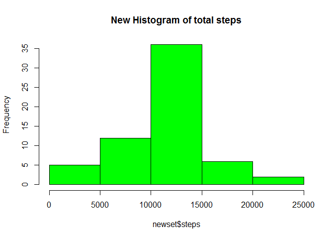

# Reproducible Research: Peer Assessment 1


## Loading and preprocessing the data

   Loading:

```r
fitbit <- read.csv("activity.csv")
```
Process and transform data

```r
totalsteps<-aggregate(steps~date,data=fitbit,sum,na.rm=TRUE)
```

## What is mean total number of steps taken per day?

```r
mean(totalsteps$steps)
```

```
## [1] 10766.19
```

```r
median(totalsteps$steps)
```

```
## [1] 10765
```

## What is the average daily activity pattern?

Average daily activity pattern

```r
steps_interval<-aggregate(steps~interval,fitbit,mean)

plot(steps~interval,data=steps_interval,type="l",main="Average daily Activity")
```

 
   5 min interval that contains more number of steps

```r
steps_interval[which.max(steps_interval$steps), ]$interval
```

```
## [1] 835
```

## Imputing missing values

   Total # of missing values (NAs)

```r
sum(is.na(fitbit$steps))
```

```
## [1] 2304
```
   Function for fullfill the gaps with the mean 

```r
fiveminmean<-function(interval){
steps_interval[steps_interval$interval == interval,]$steps
}
```
   Create a new data set with NAs replaced

```r
newdataset<-fitbit
count=0
for(i in 1:nrow(newdataset)){
  if(is.na(newdataset[i, ]$steps)){
    newdataset[i, ]$steps<-fiveminmean(newdataset[i, ]$interval)
    count=count+1
  }
}
cat("total",count,"NA values were filled.\n\r")
```

```
## total 2304 NA values were filled.
## 
```
   Histogram of the new data set

```r
newset<-aggregate(steps~date,data=newdataset,sum)
hist(newset$steps,main="New Histogram of total steps",col="green")
```

 
   Mean and Median of the new data set

```r
mean(newset$steps)
```

```
## [1] 10766.19
```

```r
median(newset$steps)
```

```
## [1] 10766.19
```

## Are there differences in activity patterns between weekdays and weekends?

   Function to create another column with day:

```r
day_of_the_week <- function(date) {
  if (weekdays(as.Date(date)) %in% c("Saturday", "Sunday")) {
    "weekend"
  } else {
    "weekday"
  }
}
newdataset$day_of_the_week <- as.factor(sapply(fitbit$date, day_of_the_week))
```
   Sample with the function:

```r
head(newdataset)
```

```
##       steps       date interval day_of_the_week
## 1 1.7169811 2012-10-01        0         weekday
## 2 0.3396226 2012-10-01        5         weekday
## 3 0.1320755 2012-10-01       10         weekday
## 4 0.1509434 2012-10-01       15         weekday
## 5 0.0754717 2012-10-01       20         weekday
## 6 2.0943396 2012-10-01       25         weekday
```
   Plot two graphs with Weekend and Weekday

```r
par(mfrow = c(2, 1))
for (type in c("weekend", "weekday")) {
  steps.type <- aggregate(steps ~ interval, data = newdataset, subset = newdataset$day_of_the_week == 
                            type, FUN = mean)
  plot(steps.type, type = "l", main = type)
}
```

 
